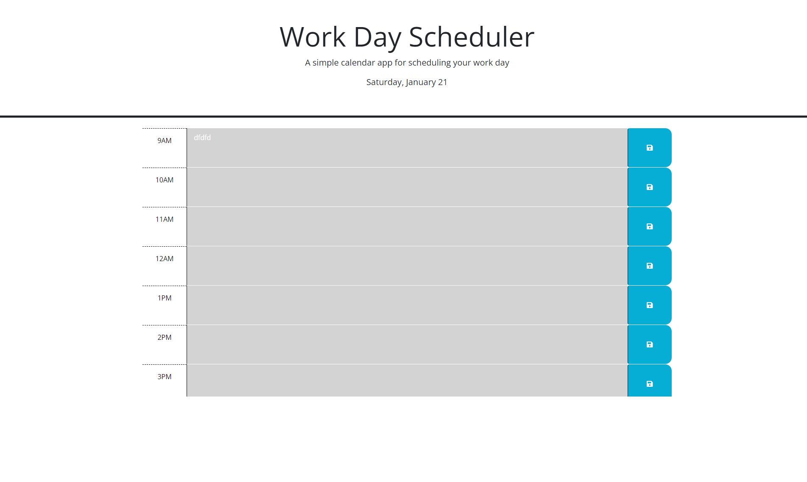

# Work Day Scheduler 
A calendar application/work day scheduler using HTML. CSS &amp; JQuery

## Description
A simple calender application that allows the user to set events on every hour and is coloured according to past, present, future hours. The use of JQuery within this project means that id's used in the HTML & CSS can be dynamically updated, such as the changing of colours according to time.

## Installation 

-Open in browser to view the web page (Link here - https://thorne7.github.io/Golden-Brown/) 
-Open in Visual Studio Code to view the code (if no VS code, open your developer window)

## Credits

Tutorials used during this challenge:

https://www.w3schools.com/jsref/prop_html_id.asp

https://www.w3schools.com/js/js_htmldom_navigation.asp

https://developer.mozilla.org/en-US/docs/Web/JavaScript/Reference/Global_Objects/String/replace

Special thanks to J.J. for assistance 

## Licence 

MIT